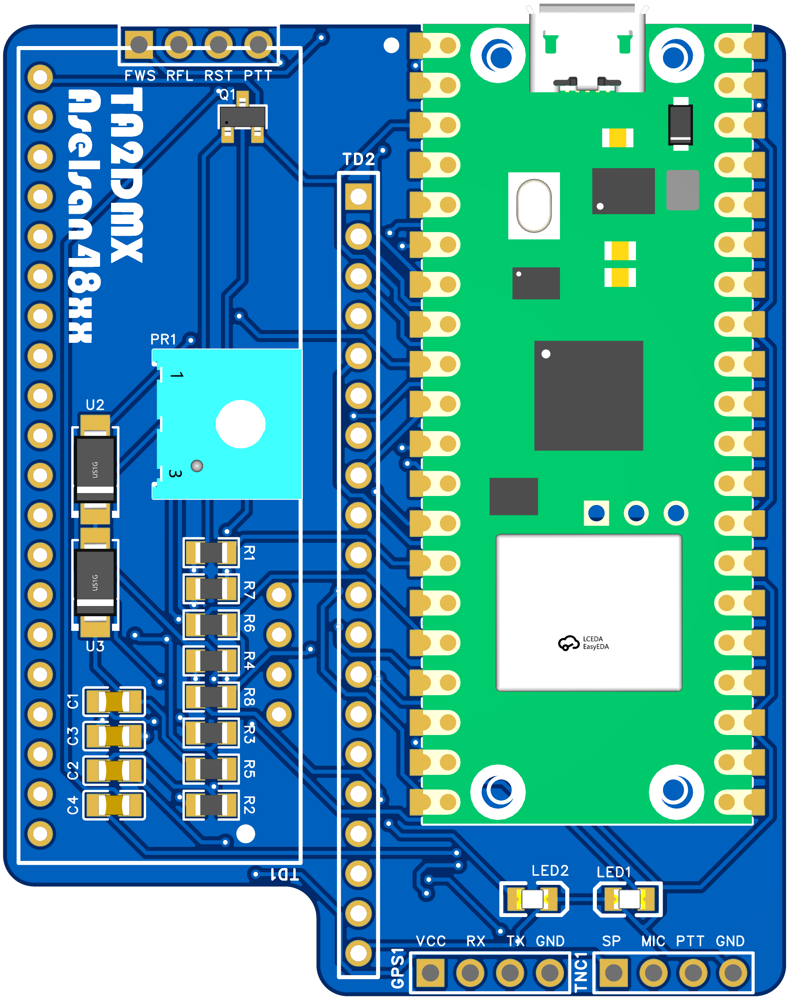
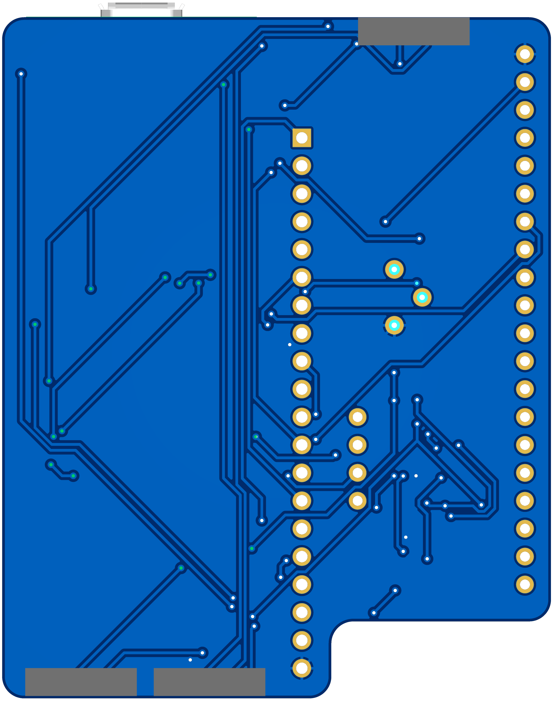
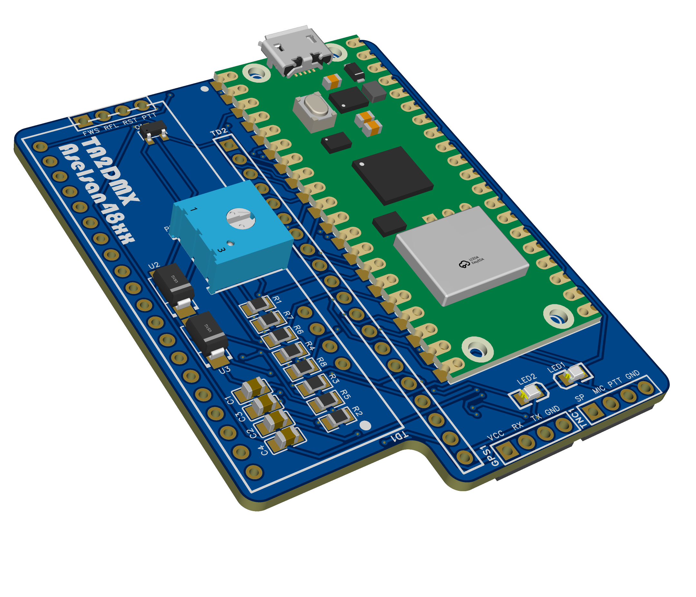
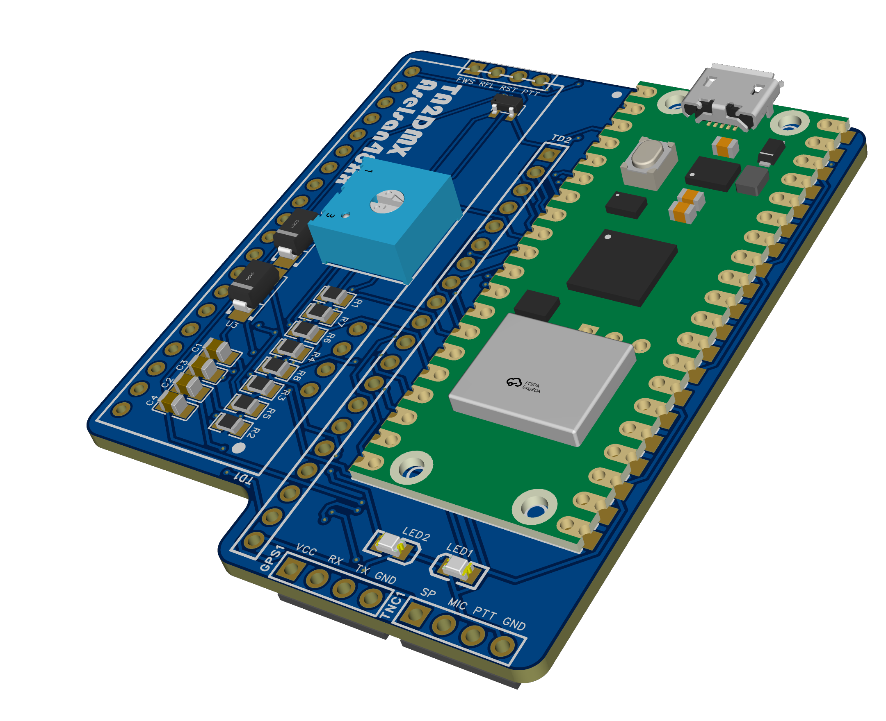
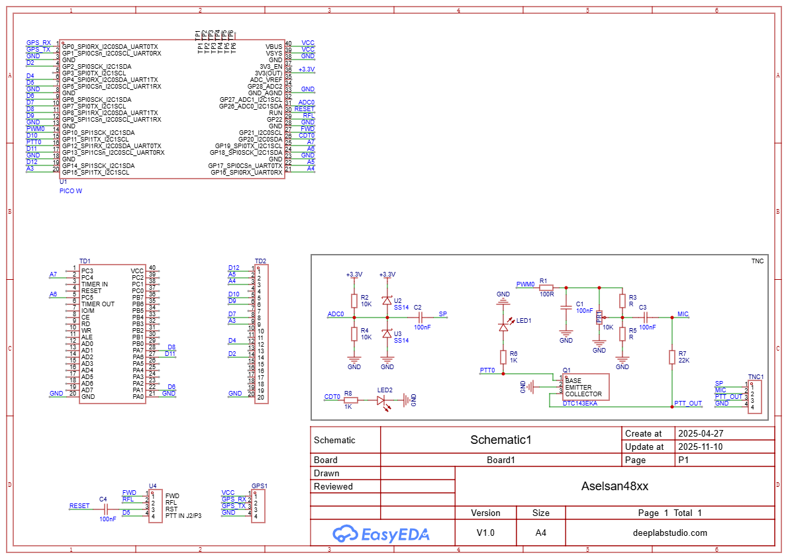

# ASELSAN 48xx Upgrade Kit  
**Raspberry Pi Pico** tabanlı, **ASELSAN 48xx serisi telsizler** için geliştirilmiş yükseltme kartı.  
Bu kart, telsizinize **modern özellikler kazandırmak** için tasarlandı.  
İlerleyen aşamalarda **TNC**, **APRS**, **frekans kontrolü** ve **dijital modlar** gibi gelişmiş yazılım özellikleri eklenecektir.

## PCB

  
  
  
  

## Schematic

## 🧩 Temel Özellikler
- **Mikrodenetleyici:** Raspberry Pi Pico (RP2040)  
- **Bağlantılar:** UART, I2C, SPI arayüzleri  
- **Uyumluluk:** ASELSAN 48xx serisi telsiz konnektörüne doğrudan uyumlu  
- **Genişletilebilir yapı:**  
  - **TNC (AX.25)** desteği  
  - **APRS** (Otomatik Konum Bildirim Sistemi)  
  - **Frekans kontrolü / dijital tuning**  
  - **CW key girişi** ve **PTT kontrolü**  
- **Besleme:** 5V (telsizden veya USB üzerinden)  
- **Tasarım:** Kompakt, modüler ve taşınabilir yapı 

## 🧠 Yazılım ve Geliştirme Planları
Bu kart, gelecekte eklenecek yazılımlar için güçlü bir temel oluşturur.  
Planlanan yazılım özellikleri:
- 📡 **TNC** (AX.25) protokolü üzerinden paket haberleşme  
- 🌍 **APRS RF / Internet Gateway** modu  
- 🎛️ **Frekans kontrolü ve kanal programlama**  
- ⚙️ **Seri veya web arayüzü üzerinden konfigürasyon**  
- 🔊 **Dijital modlar (FT8, JS8Call vb.) için ses arabirimi**

## 💡 Kullanım Amacı
**ASELSAN 48xx serisi telsizlerinizi** modern, programlanabilir ve genişletilebilir bir platforma dönüştürün.  
Sadece kartı telsize bağlayın, USB üzerinden bilgisayara takın ve yazılım geliştirmeye başlayın!

Uygun kullanım alanları:
- 🎙️ Amatör telsizcilik projeleri  
- 🧠 Gömülü sistem geliştirme  
- 📡 APRS / Paket haberleşme  
- 🧩 Deneysel haberleşme sistemleri  

## Geliştirici
[Uğur ALTINSOY](https://github.com/uguraltinsoy)
